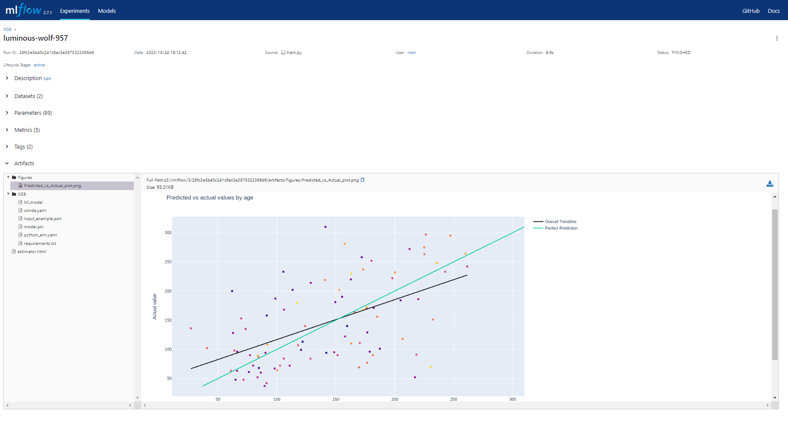

# DS_model
Playground for messing around with different Data Science related tools

Currently:
- Pre-commit hooks already set up.
- Containerized using Docker and orchestrated using Docker Compose.
- Incorporates MLflow for managing the machine learning lifecycle including model development, registry, and deployment, and experiment tracking.
- Uses MinIO to replace AWS S3 for storing MLflow objects.
- Deployed using the FastAPI web framework
- Option of training models on CPU or GPU

## Machine Learning Modeling

The project uses Scikit-learn's pipeline approach and standardized API for data preprocessing and model training. It imputes all the input data, standardizes the numerical data and encodes the categorical data.

The current version includes the usage of an XGBoost model and a custom-made data cleaning class (`DataPreprocessor`) which is compatible with Scikit-learn's pipeline API.

## MLflow for machine learning lifecycle

Uses MLflow for maintaining the machine learning lifecycle, including:
### Logging

- Data: features and samples used for training the ML models
- Configuration: pipeline configuration, including any preprocessing done before training.
- Parameters: model training parameters.
- Models: trained models and pipelines.
- Metrics: model training metrics and results.
- Artifacts: additional files and images created while running the pipeline (e.g. result plots and graphs)
### Project/experiment based tracking

### Model registry

- Store, organize and annotate existing models.
- Deploy models in different environments (e.g. PySpark or through a REST API)

### MinIO instance for artifact storage

Creates and runs a MinIO server locally for storing S3 artifacts. It uses nginx as a reverse proxy.

## FastAPI

Web framework used to deploy the machine learning models. RESTful API to handle model prediction requests.

## Docker Compose
Defines the multi-container application to spin up or tear down all services with a single command. Services include:
- MLflow server
- MinIO server
- nginx for reverse proxying of MLflow AWS calls to MinIO.
- PostgreSQL
- pgadmin
- training service based on CPU
- training service based on GPU
- fastapi server
