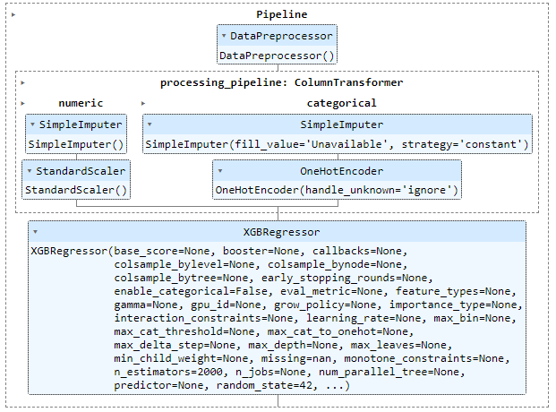

# DS_model
Playground for messing around with different Data Science related tools

Currently:
- Pre-commit hooks already set up.
- Containerized using Docker.
- Incorporates MLflow using MinIO for replacement of AWS S3 for storing MLflow objects.

## Images
### XGB Model SKlearn Pipeline

### MLflow example run

### MinIO run locally

